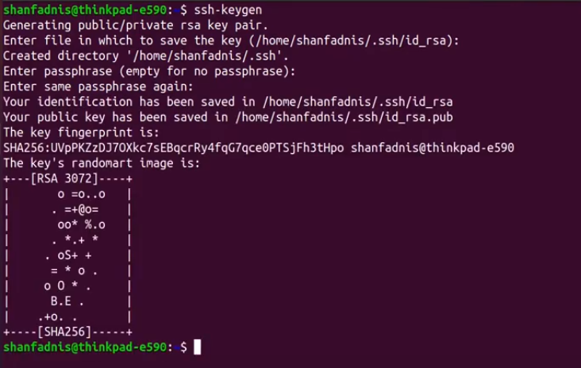

# My-Ubutnu

###### Setup my ubuntu environment
---

## prerequisite

> Open terminal and type the following commands

- Installing updates `sudo apt-get update`
- Installing git `sudo apt-get install git`
- Installing curl `sudo apt-get install curl`
- Installing wget `sudo apt-get install wget`
- Intalling C/C++ Compiler `sudo apt install g++`
- Installing gnome for additional settings `sudo apt install gnome-tweaks` 

---

## Initalizing Git

> Configuring Git username and email

**Open terminal and type the following commands**
```bash
git config --global user.name "Your Name"
```
```bash
git config --global user.email "Your Email"
```
- [x] You have successfully configured Git username and email

> Generating a new SSH key

**Firstly open terminal to generte SSH so type the following**
```bash
ssh-keygen
```
###### You will be asked for a file to save the key in, just press enter to accept the default location.
###### Then you will be asked to enter a passphrase, it is optional you can press enter twice to leave it blank.



- [x] Now you have generated SSH key successfully like in the image above.

###### Type the following on your terminal to copy the key 

```bash
cat ~/.ssh/id_rsa.pub
```
###### Copy the key you will get and paste it in your github account, explained in the next step.

**Secondly go to your github account**
- [ ] After going to your github account click on your profile picture and click on settings.
- [ ] Then click on SSH and GPG keys.
- [ ] Click on New SSH key.
- [ ] Give a title to your key and paste the key you copied from your terminal.

- [x] You have successfully added SSH key to your github account.

---

## Setting up IDE (VS Code)

> Installing VS Code

**Open terminal and type the following commands**
```bash
sudo snap install --classic code
```
- [x] You have successfully installed VS Code.

> Installing VS Code extensions

**go to extensions in VS Code and install the following extensions**
- [ ] C/C++
- [ ] Code Runner
- [ ] C/C++ Themes
- [ ] CMake
- [ ] Markdown Preview Enhanced
- [ ] Markdown All in One

- [x] You have successfully installed VS Code extensions.

> Setting up VS Code

- [ ] Auto Save: File > Auto Save
- [ ] Run Code: File > Preferences > Settings > Extensions > Run Code Configuration > Check Run In Terminal 
- [x] You have successfully setup VS Code.

---

## Setting up zsh/oh-my-zsh

> Installing zsh

**Open terminal and type the following commands**
```bash
sudo apt-get install zsh
```
- [x] You have successfully installed zsh.

> Installing oh-my-zsh

**Open terminal and type the following commands**
```bash
sh -c "$(curl -fsSL https://raw.githubusercontent.com/ohmyzsh/ohmyzsh/master/tools/install.sh)"
```
- [x] You have successfully installed oh-my-zsh.

# to be continued...

---
